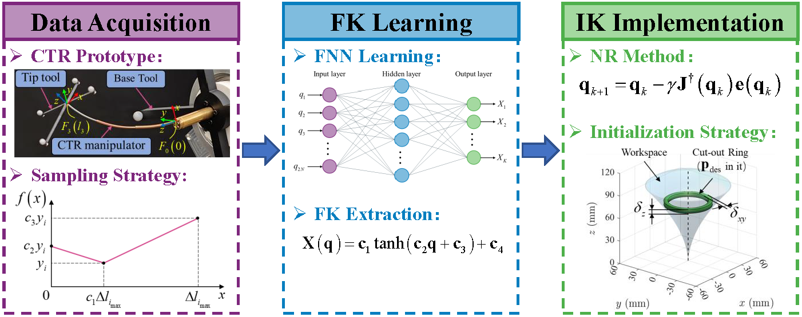

# Learning-Based Forward Kinematics and Its Inverse Kinematics Implementation for Concentric-Tube Robots

## Introduction
This repository contains the accompanying dataset of our paper "Learning-Based Forward Kinematics and Its Inverse Kinematics Implementation for Concentric-Tube Robots" submitted to IEEE/ASME Transactions on Mechatronics.
The dataset contains 35,000 CTR configuration samples, which was collected from a CTR prototype.

* [Manuscript](/assets/Manuscript.pdf.pdf)
* Authors: *Chao Zhang, Shuang Song, and Jiaole Wang.*
