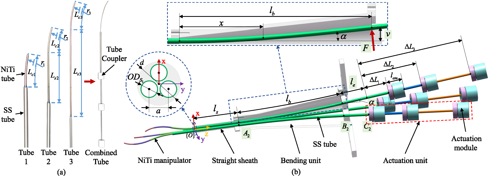
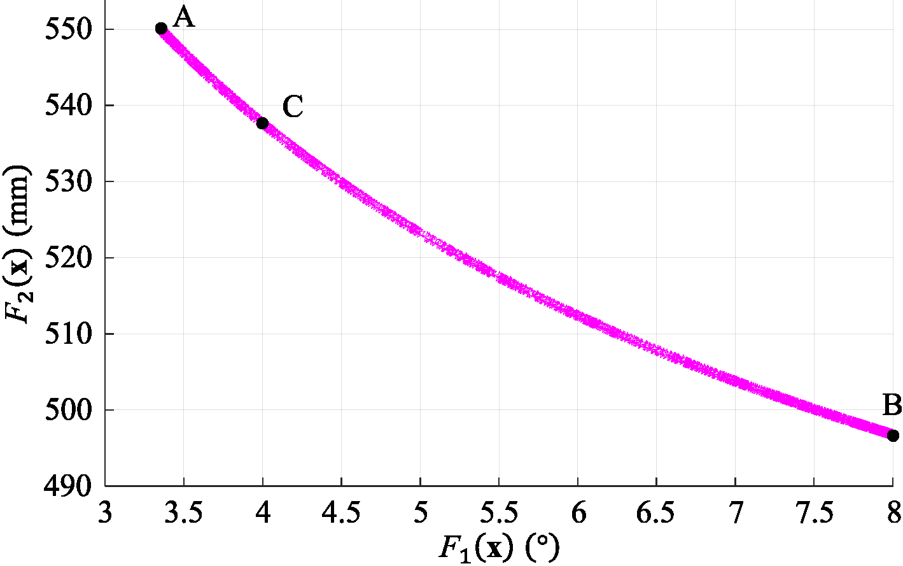
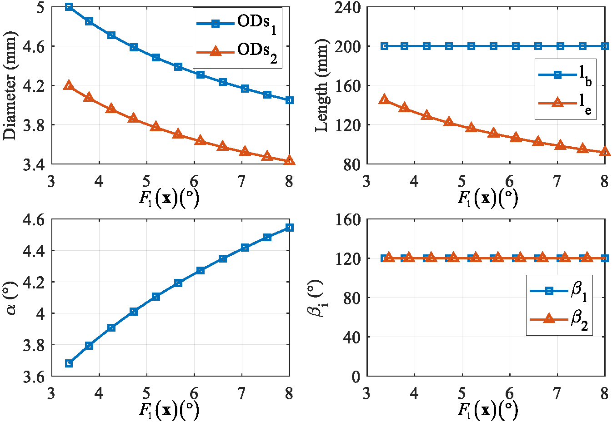

# Design Optimization of Pyramid-Shaped Transmission System for Multiarm Concentric-Tube Robots

## Introduction
This repository contains the accompanying code of our paper "Design Optimization of Pyramid-Shaped Transmission System for Multiarm Concentric-Tube Robots", which was publicated in IEEE/ASME Transactions on Mechatronics.

* [Full Paper Link](https://ieeexplore.ieee.org/abstract/document/10386074)

* Authors: *Chao Zhang, Guangdu Cen, Xing Yang, et al.*


## File Tree

* assets (*Figures for readme.md*)
* Y-shaped_dual-arm
* Pyramid-shaped_multi-arm
  * Case_1 (Three-armed CTR with 2 tubes in each arm)
    * optimal_design_framework.m
    * CTR_params.m
    * elastic_stability.m
    * multiobjective_func.m
  	 * nonlinear_constraints.m
    * determine_result.m
  	 * variables_variation.m
  * Case_2 (Four-armed CTR with 3 tubes in each arm)
    * optimal_design_framework_2.m
    * CTR_params_2.m
    * multiobjective_func_2.m
  	 * nonlinear_constraints_2.m
    * determine_result_2.m
  	 * variables_variation_2.m
  * Torque_Calculation (Computing the maximum generated torque for case 2) 
    * CTR_Torque.m
    * CTR_params.m
    * ctr_fk_compliant.m
    * segment.m

## Running the Code (*Case_1*)
1. **Add forder path** to Matlab command window;

2. Run "**optimal_design_framework.m**" to establish the design constraints, formulate the multi-objective optimization problem, solve the problem, and get the Pareto front;



3. Run "**variables_variation.m**" to see the variation of optimization variable $\mathbf{x}=[OD_{S1}, OD_{S2},\cdots,l_b, \alpha, l_e, \beta_1,\beta_2,\cdots,\beta_{n-1}]$; 



4. Run "**determine_result.m**" to get the optimal design result.


## Design Your Own Pyramid-Shaped Transmission System
1. Modify "**CTR_params.m**" based on you own NiTi manipulators and SS tube materials. (The generated torque of NiTi manipulators can also be computed using "**elastic_stability.m**"(2 tubes case) or "**/Torque_Calculation/CTR_Torque.m**"(3 tubes case).)

2. Run "**optimal_design_framework.m**" once, then update the two functions "**multiobjective_func.m**" and "**nonlinear_constraints.m**" manually based on the output of the code segment in **optimal_design_framework.m**

```matlab
%% Function and Constraints Generation
% !! Update "multiobjective_func.m" and "nonlinear_constraints.m" manually

% F(1) = zeta_i
Func_1 = (180/pi)*zeta_1

% F(2) = le+lb
Func_2 = le + lb

% ODs_2 <= ODs_1-2*w-2*delta
Cons_1 = ODs_2 - ODs_1 + 2*w + 2*delta

% epsilon <= epsilon_e
Cons_2 = epsilon - epsilon_e

% zeta_i<=zeta_max
Cons_3 = (180/pi)*(zeta_2 - zeta_max)

% d1>=0 -> -d1<=0
Cons_4 = - subs(d1,beta_1,2*pi/n)

% zeta_1=zeta_2
Cons_5 = (180/pi)*(zeta_1 - zeta_2)
```
3. Run "**optimal_design_framework.m**" again after updating the two functions to get the Pareto front.

4. Run "**variables_variation.m**" to see the variation of optimization variable.

5. Select a preferred point on the Pareto front

6. Modify "**determine_result.m**" based on your selected value, and then run it.

You can get the optimally designed pyramid-shaped transmission system for your own multi-arm concentric-tube robot!
