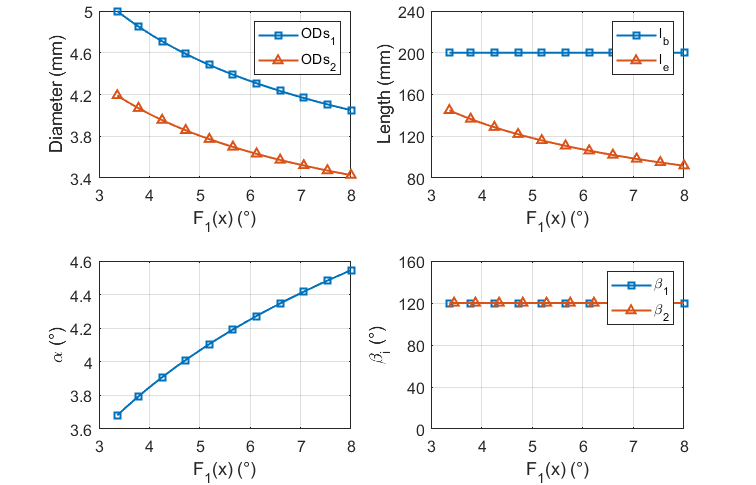

# Design Optimization of CTR Transmission System

## Introduction
This repository contains code about how to design an optimal pyramid-shaped transmission system for multi-arm concentric-tube robots (CTR) . 

* Full paper PDF: [Manuscript submitted to TMECH.](assets/Manuscript.pdf)

* Authors: *Chao Zhang, Guangdu Cen, Xing Yang, et al.*

## File Tree

* assets (*PDF and figures, etc*)
* Transmission_System_Optimal_Design (*Matlab code*)
  * Pyramid-shaped_multi-arm
    * Case_1
      * CTR_params.m
	  * optimal_design_framework.m
	  * variables_variation.m
      * determine_result.m
      * elastic_stability.m
	  * multiobjective_func.m
	  * nonlinear_constraints.m
    * Case_2
	  * CTR_params.m
	  * optimal_design_framework.m
	  * variables_variation.m
      * determine_result.m
      * elastic_stability.m
	  * multiobjective_func.m
	  * nonlinear_constraints.m
  * Y-shaped_dual-arm

## Runding the Code
1. Add the path to Matlab commandd window

2. Run "optimal_design_framework.m" to get the Pareto front

3. Run "variables_varying.m" to see the variation of optimization variable **x** = [$OD_{s1}$, $OD_{s2}, $\cdots$, $OD_{sm}$, $l_b$, $\alpha$, $l_e$, $\beta_1$, $\beta_2$, $cdots$, $\beta_{n-1}$] ; 

4. Run "determine_result.m" to get the final optimal result.

